# Castle Tours

[Castle Tours](https://ts2017185.github.io/castletours/index.html) is an engaging and informative website designed to provide users with an enriching experience of exploring castles around Ireland. 

The site aims to be a comprehensive resource for history enthusiasts, tourists, and people who are fascinated by the architectural and cultural significance of castles. By offering and suggesting detailed tours, historical context, and stunning visuals, Castle Tours hopes to inspire its audience with the opportunity to visit these magnificent structures.

The primary goal of Castle Tours is to make historical tours accessible and enjoyable. The site is targeted towards individuals who have a keen interest in history, architecture, and castles. It serves as a useful tool for suggesting visits and offering planned tours to some of Ireland's most iconic castles.

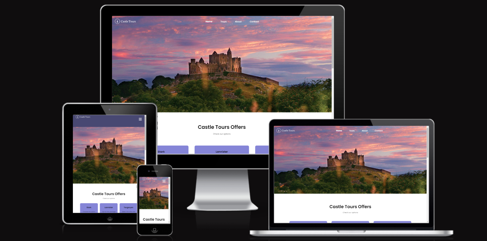

## Features 

In this section, you will find an overview of the key features of the Castle Tours website, each designed to enhance the user experience and provide valuable information.

### Home Page

__Navigation Bar__

 - Description: Featured at the top, the fully responsive navigation bar includes links to the Logo, Home page, Tours page, Gallery, and Contact page.
 - Value: This feature allows users to easily navigate between different sections of the website, ensuring a seamless browsing experience.


__Header Section__

 - Description: The header section features an engaging introduction with visually appealing elements.
 - Value: Captures the user's attention immediately and sets the tone for the site, encouraging them to explore further.

 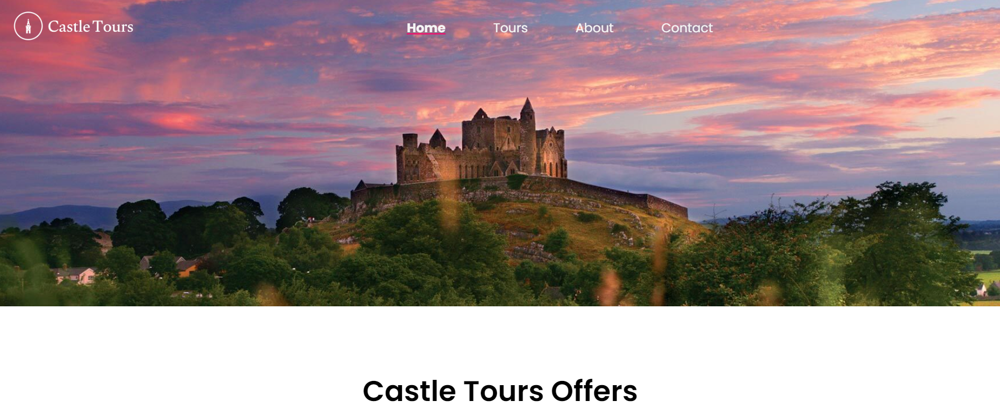

__Castle Tours Offers Section__

 - Description: This section highlights three different tour packages: Stark, Lannister, and Targaryen. Each package includes a brief description of what it offers.
 - Value: Provides users with clear options for different tour experiences, allowing them to choose the one that best suits their interests and needs.

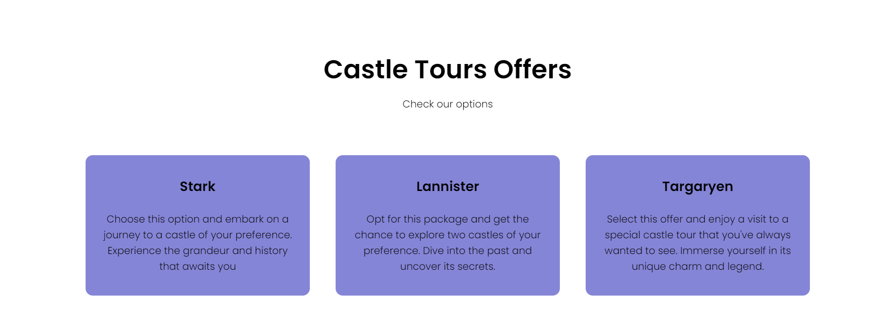

__Video Section__

 - Description: An immersive video background that plays automatically and loops, showcasing beautiful footage related to castles and their surroundings.
 - Value: Enhances the visual appeal of the site, providing an engaging way for users to experience the ambiance of castle tours.

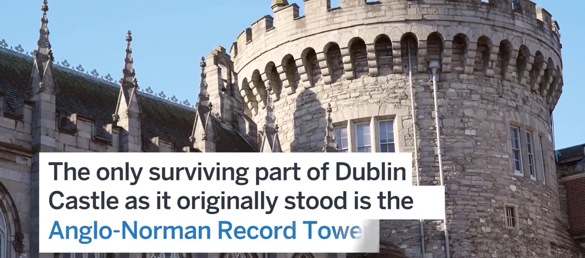

__Testimonials Section__

 - Description: Features testimonials from satisfied customers, complete with images and quotes about their experiences.
 - Value: Provides social proof and builds trust with potential customers, encouraging them to book a tour based on positive feedback from others.

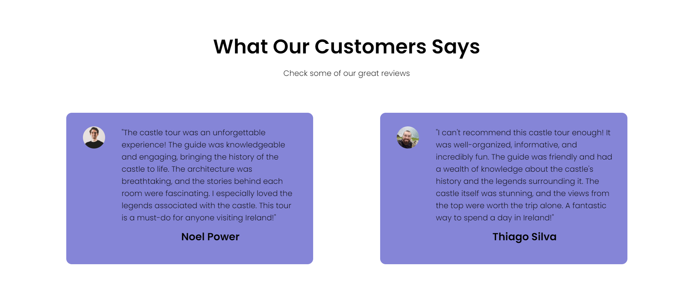

__Footer__

 - Description: The footer includes contact information, such as the address, phone number, email, and social media links.
 - Value: Ensures users can easily find and use the contact details, fostering communication and engagement with the Castle Tours team.


__Mobile Navigation__

 - Description: The site features a mobile navigation system with a menu button that toggles the display of navigation links.
 - Value: Ensures a user-friendly experience on mobile devices, allowing users to navigate the site easily.

By focusing on these features, the Castle Tours Home page ensures that users have an engaging, informative, and easy-to-navigate introduction to the site, making it the perfect starting point for their journey into the world of castles.


### Tours Page

__Header Section__

 - Description: The header features the name of a highlighted castle, "The Rock of Cashel," with a call-to-action button linking to more information.
 - Value: This visually appealing introduction immediately captures the user's interest and directs them to further details about the highlighted castle.

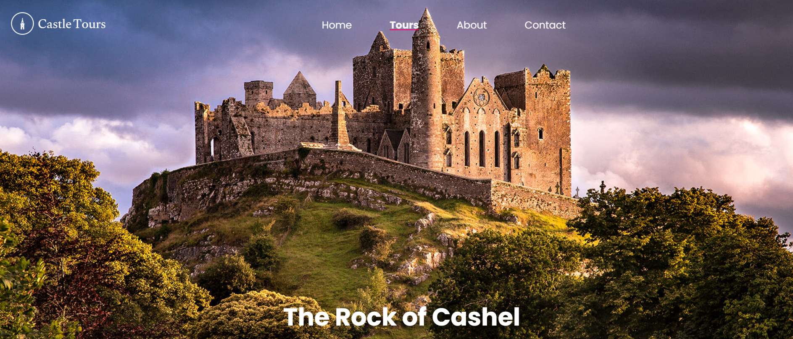

__Events Section__

 - Description: This section lists tours available in June, featuring castles like Ross Castle and Kylemore Abbey & Victorian Walled Garden with images, descriptions, and links to more information.
 - Value: Users can easily browse through upcoming tours, gaining insights into the history and significance of each featured castle.

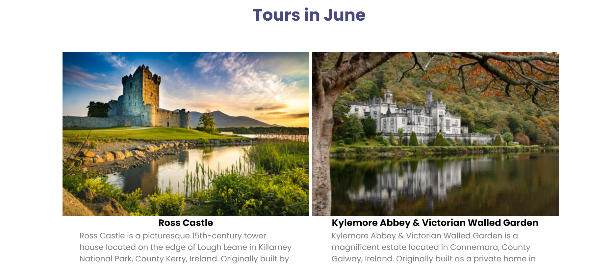
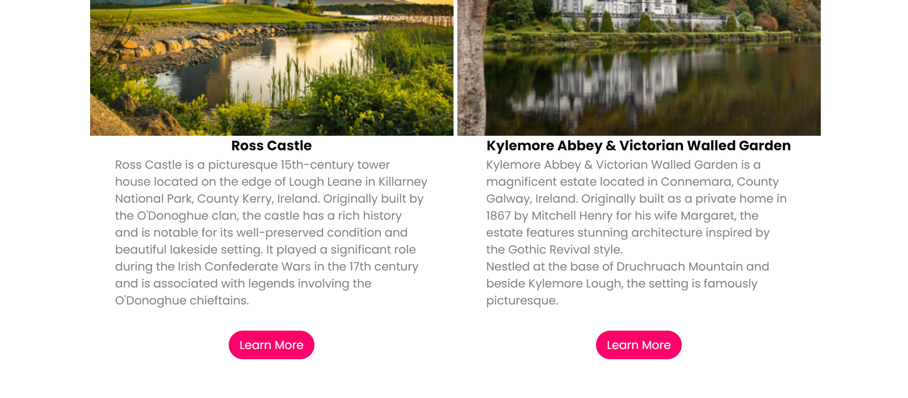

__Explore Section__

 - Description: An engaging video background with an overlay box highlighting "The Blarney Castle" and a call-to-action button for more information.
 - Value: This immersive section provides a captivating introduction to another notable castle, enhancing the visual and interactive experience for users.

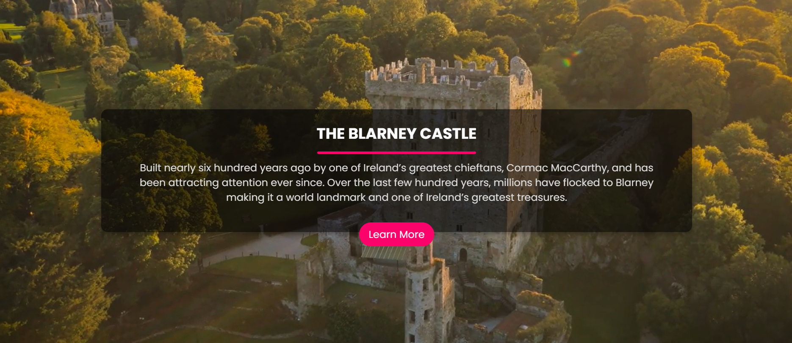

__Upcoming Tours & Destinations Section__

 - Description: A section that highlights upcoming tours and destinations with a brief description and a link for more information. It also features an image gallery.
 - Value: Users can stay informed about future tours and popular destinations, encouraging them to explore more and stay connected through social media.

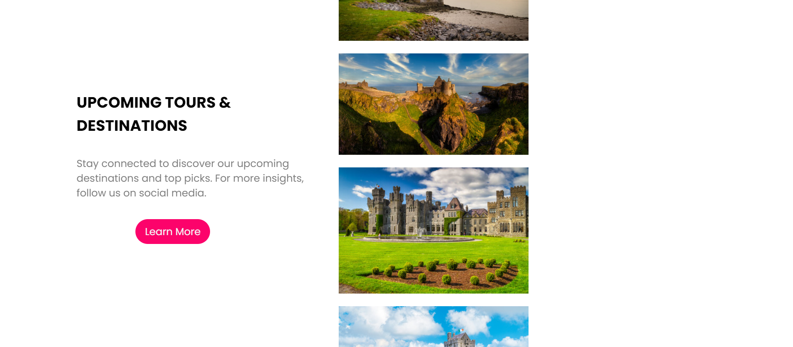

Focusing on these features, the Tours page ensures that users have access to detailed, engaging, and easy-to-navigate information about castle tours, making it the perfect resource for planning their next historical adventure.


### About Page

__Header Section__

 - Description: The header section provides a clean and professional introduction to the About page.
 - Value: Sets the tone for the content, ensuring users know they are in the right place to learn more about Castle Tours.

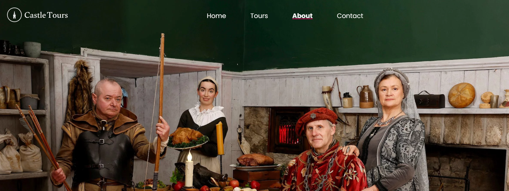

__About Us Section__

 - Description: This section provides a detailed description of Castle Tours, emphasizing its position as the world's leading castle tour company. It highlights the company's commitment to offering immersive and meticulously designed tours, led by knowledgeable guides who bring the rich history and legends of each castle to life.
 - Value: Helps users understand the mission and values of Castle Tours, building trust and interest in the company's offerings.

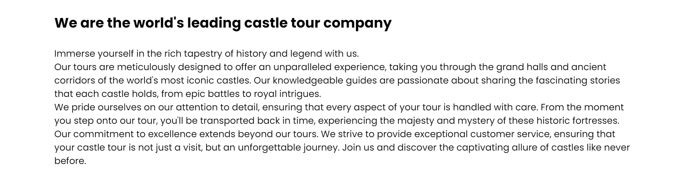

__Gallery Section__

 - Description: This section features images from Castle Tours' special gallery, showcasing various tours and the majestic castles included in the offerings.
 - Value: Provides a visual representation of the tours, enhancing the appeal and giving users a glimpse of what they can expect.

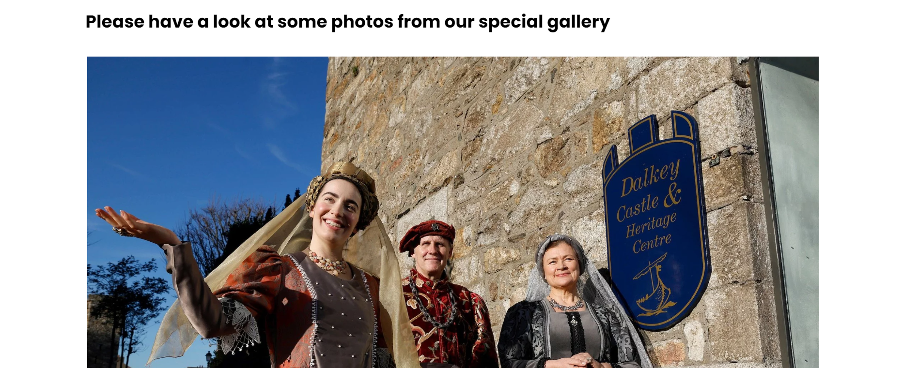

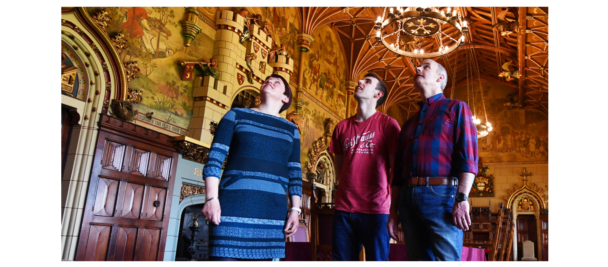

- The Castle Tours About page ensures that users have a clear, informative, and engaging overview of the company, making it the perfect resource for understanding the mission, values, and offerings of Castle Tours.


### Contact Page Features

__Header Section__

 - Description: The header section provides a clean and professional introduction to the Contact page.
 - Value: Sets the tone for the content, ensuring users know they are in the right place to get in touch with Castle Tours.


__Location Section__

 - Description: This section features a Google Maps iframe showing the location of Castle Tours' headquarters at 88 Grafton Street, Dublin, D02 VF65, Ireland.
 - Value: Helps users to easily locate the Castle Tours office, providing visual and interactive location information.

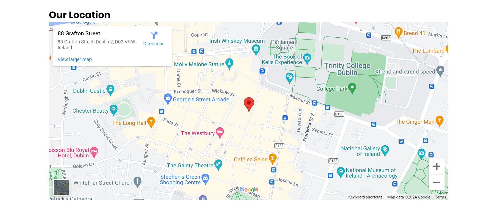

__Contact Us Section__

 - Description: This section provides detailed contact information including the physical address, phone number, and email address. It also includes a contact form for users to send messages directly through the website.
 - Value: Offers multiple ways for users to get in touch with Castle Tours, ensuring accessibility and convenience. The contact form allows users to send queries or messages directly, facilitating efficient communication.

__Contact Form__

 - Description: The contact form includes fields for name, email, subject, and message, along with a submit button to send the information.
 - Value: Provides a straightforward way for users to reach out with questions or comments, enhancing user engagement and support.

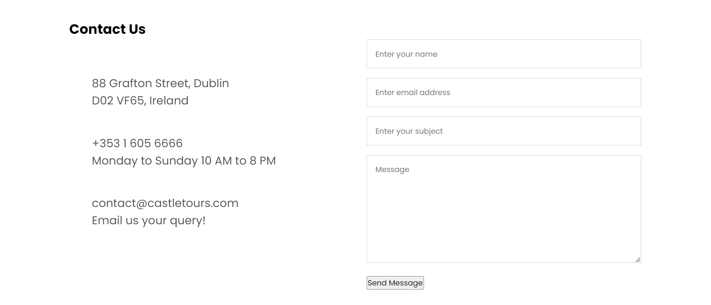

__JavaScript Functionality__

 - Description: JavaScript is used to enhance the functionality of the contact form, ensuring all fields are filled before submission and providing a success message once the form is submitted.
 - Value: Improves the user experience by providing immediate feedback and ensuring that the contact form is used correctly.

```
 document.getElementById('sendBtn').addEventListener('click', function(e) {
                e.preventDefault();
                var name = document.getElementById('name');
                var email = document.getElementById('email');
                var subject = document.getElementById('subject');
                var message = document.getElementById('message');

                if (name.value === "" || email.value === "" || subject.value === "" || message.value === "") {
                    alert('Please fill all the fields!');
                } else {
                    alert('Your message has been sent successfully!');
                    name.value = "";
                    email.value = "";
                    subject.value = "";
                    message.value = "";
                }
            });
```

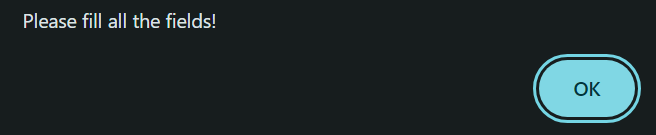

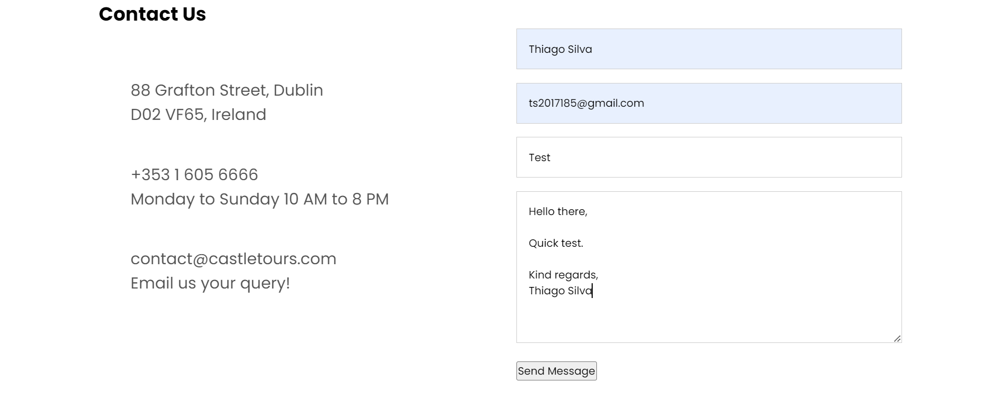

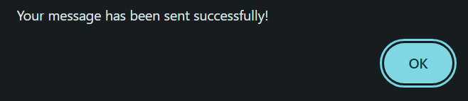

- Focusing on these features, the Contact page ensures that users have access to all necessary information to get in touch with the team, making it the perfect resource for inquiries, support, and engagement.

    - [Home](https://ts2017185.github.io/castletours/index.html)
    - [Tours](https://ts2017185.github.io/castletours/tours.html)
    - [About](https://ts2017185.github.io/castletours/about.html)
    - [Contact](https://ts2017185.github.io/castletours/contact.html)

### Features Left to Implement

__Enhanced Tour Booking System__

 - Description: An integrated booking system that allows users to book tours directly through the website.
 - Value: Provides a seamless and convenient booking experience for users, increasing the likelihood of tour reservations.

__User Account Management__

 - Description: A feature allowing users to create accounts, manage their bookings, and receive personalized recommendations.
 - Value: Enhances user engagement by providing a personalized experience and making it easier to manage tour information.

__Interactive Historical Timeline__

 - Description: An interactive timeline that provides detailed historical information and significant events related to each castle.
 - Value: Educates users and enriches their understanding of the historical context and significance of the castles.


## Testing

Based on extensive testing across various features, browsers, and devices, the Castle Tours site is functioning well and providing a user-friendly experience. All core features operate as intended, ensuring users can easily navigate, find information, and contact the company.

### Features Testing

__Navigation Bar__

 - Test: Ensure all links in the navigation bar navigate to the correct pages.
 - Result: All links function correctly across all pages and on various devices.

__Header Section__

 - Test: Check that the header section displays correctly and provides a clear introduction to the page.
 - Result: The header section is displayed properly on all tested browsers and screen sizes.

__Location Section__

 - Test: Verify that the Google Maps iframe loads correctly and accurately displays the location.
 - Result: The map is interactive and shows the correct location without issues.

__Contact Us Section__

 - Test: Ensure that contact details are correctly displayed and the contact form functions as expected.
 - Result: Contact information is correct and the form submissions work, triggering appropriate alerts and resetting form fields.

__Footer__

 - Test: Confirm that the footer contains accurate contact details and links.
 - Result: The footer displays correctly and links work as expected.

__Mobile Navigation__

 - Test: Validate the mobile navigation toggles between showing and hiding the menu.
 - Result: Mobile navigation works seamlessly, allowing users to open and close the menu as intended.

__JavaScript Functionality__

 - Test: Check that the JavaScript functions correctly to validate the contact form and toggle mobile navigation.
 - Result: JavaScript functionality performs well, ensuring the form is validated and the mobile menu toggles appropriately.

### Cross-Browser and Cross-Device Testing

__Browsers Tested:__

- Google Chrome
- Mozilla Firefox
- Microsoft Edge
- Safari

__Devices Tested:__

- Desktop (various screen sizes)
- Tablet
- Mobile

- Results: The site performs consistently across all tested browsers and devices. Responsive design elements ensure that the layout adapts well to different screen sizes.

__Bugs and Issues__

- Issue: Sometimes, the videos does not load on slow internet connections, or when the updates are quite big.
- Status: Not yet addressed. Considering reduce the quality or the size of the videos.

- Issue: Occasionally, the Google Maps iframe does not load on slow internet connections.
- Status: Not yet addressed. A potential solution could be to provide a fallback static image of the location.

###Code Validation

All the code has been run through the [W3C html Validator](https://validator.w3.org/nu/?doc=https%3A%2F%2Fts2017185.github.io%2Fcastletours%2Findex.html) and the [W3C CSS Validator](https://jigsaw.w3.org/css-validator/validator?uri=https%3A%2F%2Fts2017185.github.io%2Fcastletours%2Findex.html&profile=css3svg&usermedium=all&warning=1&vextwarning=&lang=en). Minor errors were found on the Home and Tours pages. After a fix and retest, no errors were returned for both.

__The HTML/CSS validator results for each page are below:__

Home Page

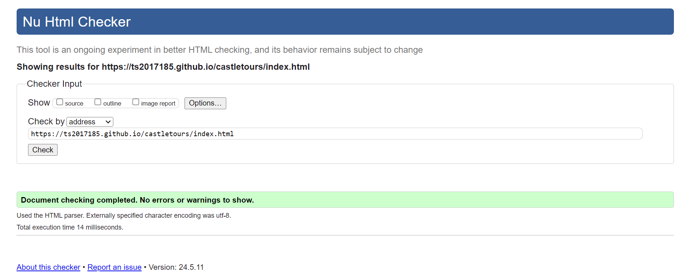


Tours Page

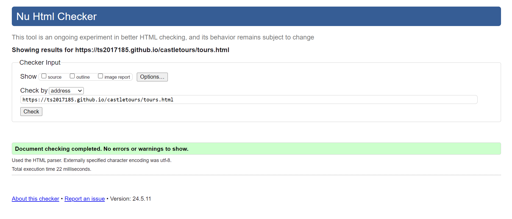
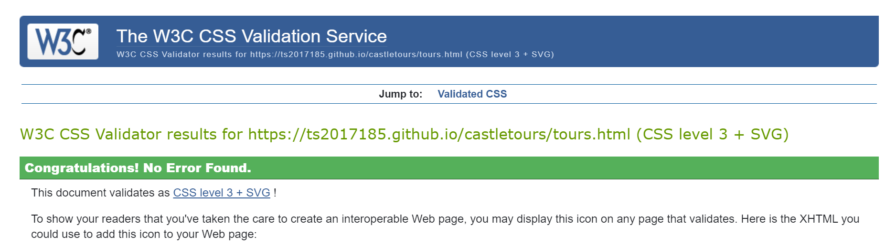

About Page


Contact Page

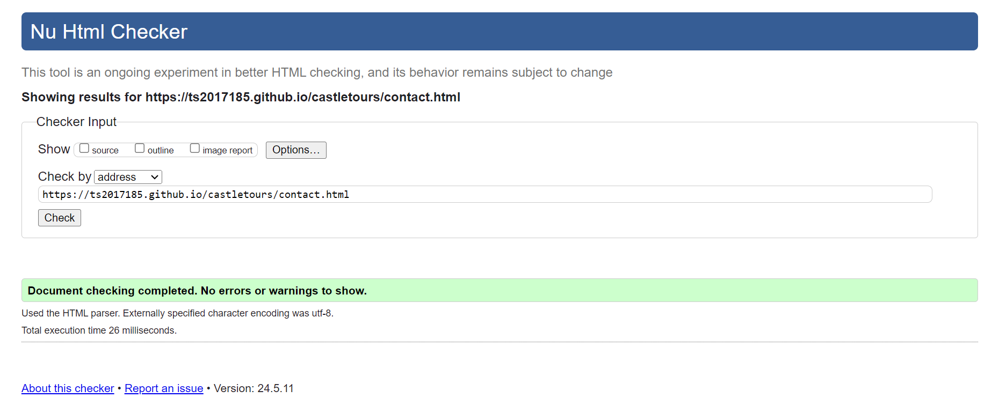
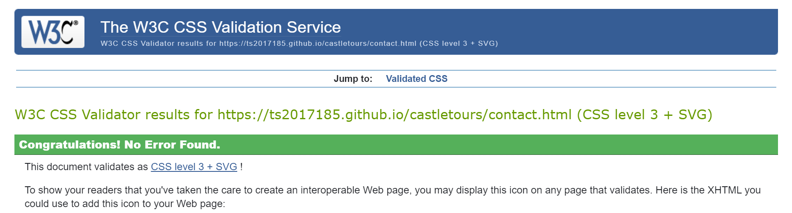


## Unfixed Bugs

__Home Page Video Responsiveness__

 - Description: The home page video is not fully responsive. If you zoom in, the video does not adjust correctly after a specific size.
 
 - Reason Not Fixed: Unfortunately, due to the time constraints, I was not able to fix this minor error. The issue arises from limitations in the CSS framework used, which does not fully support responsive video scaling under certain conditions. However, it is definitely something that I will address in the near future to ensure a fully responsive design across all devices and screen sizes.

 - Future Fix: I plan to implement a more robust responsive design for the video, potentially using a different approach such as a CSS framework that better supports responsive media elements or custom CSS to handle video scaling more effectively.

 ## Deployment

__Deployment to GitHub Pages__

The live link can be found here - https://ts2017185.github.io/castletours/ 

Deploying the Castle Tours website to GitHub Pages involves several steps. GitHub Pages is a static site hosting service designed to host your personal, organization, or project pages directly from a GitHub repository.

__Steps to Deploy__

1. Create a GitHub Repository:

    - Go to GitHub and log in to your account.
    - Click the "+" icon in the top right corner and select "New repository."
    - Name your repository (e.g., castletours), add a description, and choose whether it will be public or private.
    - Initialize the repository with a README file.

2. Clone the Repository:

    - Open your terminal or command prompt.
    - Clone the repository to your local machine using the following command:
    ```
    git clone https://github.com/your-username/castletours.git
    ```
    Replace '__your-username__' with your GitHub username.

3. Add Project Files:

    - Copy all the project files (HTML, CSS, JavaScript, images, etc.) into the cloned repository directory.
    - Ensure your '__index.html__' file is in the root directory of the repository, as GitHub Pages uses this file as the entry point for the site.

4. Commit and Push Changes:

    - Navigate to the repository directory in your terminal or command prompt.
    Add all the files to the staging area using:
    ```
    git add .
    ```
    - Commit the changes with a descriptive message:
    ```
    git commit -m "Initial commit with project files"
    ```
    - Push the changes to GitHub:
    ```
    git push origin main
    ```
    - Note: If your default branch is '__master__', replace '__main__' with '__master__'.

5. Enable GitHub Pages:

    - Go to your repository on GitHub.
    - Click on "Settings" in the repository menu.
    - Scroll down to the "GitHub Pages" section.
    - Under "Source," select the branch you want to deploy from (e.g., '__main__' or '__master__').
    - Click "Save."

6. Access Your Website:

    - After enabling GitHub Pages, you will see a URL where your site is hosted. It will be in the format:
    ```
    https://your-username.github.io/castletours/
    ```
    Visit this URL to see your live site.

__Continuous Deployment__

- Commit and Push Changes: Whenever you make updates to your project, commit and push the changes to the same branch you have configured for GitHub Pages.

- Automatic Updates: GitHub Pages will automatically rebuild and update your site with the latest changes.

## Credits 

[Balsamiq](https://balsamiq.com/wireframes/) was used to create the wireframes.

The font came from [Google Fonts](https://fonts.google.com/).

The map is embedded from [Google Maps](https://www.google.com/maps/@52.469397,5.509644,8z?entry=ttu).

The form validation and pop up window idea came from my mentor [Precious Ijege](https://www.linkedin.com/in/precious-ijege-908a00168/).

The inspiration for the Project pages came from [Visit Holland](https://www.holland.com/global/tourism).

__Media__

The photos and videos came from [MEGAPIXL](https://www.megapixl.com/).

__Tours Mentioned on site__

 - [The Rock of Cashel](https://heritageireland.ie/places-to-visit/the-rock-of-cashel/)

 - [Ross Castle](https://heritageireland.ie/places-to-visit/ross-castle/)

 - [Kylemore Abbey](https://www.kylemoreabbey.com/)

 - [Blarney Castle](https://blarneycastle.ie/)


## Acknowledgementss

The site was created as a Portfolio 1 Project for the Full Stack Software Developer (e-Commerce) Diploma at the Code Institute. I would like to extend my gratitude to my mentor, Precious Ijege, the Slack community, and everyone at the Code Institute for their invaluable help and support. Castle Tours is a fictional company designed to assist castle enthusiasts who may not realize how close they are to experiencing the grandeur of these historical structures. The site aims to provide an exceptional opportunity for them to explore and visit these magnificent castles.


